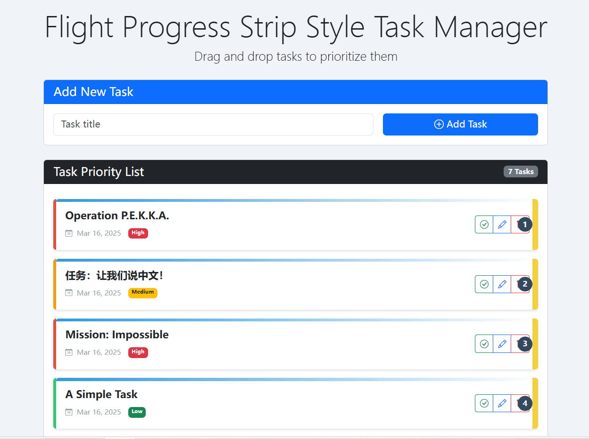

# Flight Progress Strip Style Task Manager

A Django web application for managing tasks with a drag-and-drop interface inspired by flight progress strips used in air traffic control.



## Features

- Beautiful UI inspired by Flight Progress Strips
- Drag and drop task prioritization using SortableJS
- Color-coded task categories and priority levels
- Due date tracking with overdue warnings
- Task completion tracking
- Mobile-friendly responsive design

## Installation

1. Clone the repository
2. Install the requirements:
   ```
   pip install -r requirements.txt
   ```
3. Generate a secret key and set environment variable:
   ```bash
   python -c "from django.core.management.utils import get_random_secret_key; print(get_random_secret_key())"
   # Add to your environment variables (Unix):
   export DJANGO_SECRET_KEY='your_generated_secret_key_here'
   # For Windows CMD:
   set DJANGO_SECRET_KEY=your_generated_secret_key_here
   ```
   For permanent storage, add this to your shell configuration file (.bashrc, .zshrc) or use a .env file. Remember to add `.env` to your `.gitignore`.
4. Apply migrations:
   ```
   python manage.py migrate
   ```
5. Create a superuser (for admin access):
   ```
   python manage.py createsuperuser
   ```
6. Run the development server:
   ```
   python manage.py runserver 0.0.0.0:8000
   ```

### Production Deployment with Gunicorn

For production environments, use Gunicorn instead of the development server:

1. Install Gunicorn:
   ```
   pip install gunicorn
   ```

2. Start the application with Gunicorn:
   ```
   gunicorn --bind 0.0.0.0:8000 mainsite.wsgi:application
   ```

   Optional parameters:
   - `--workers 3` : Number of worker processes
   - `--daemon` : Run in background
   - `--log-file=/path/to/gunicorn.log` : Log file location


## Initial Setup

1. Access the admin interface at `http://localhost:8000/admin/` and log in with your superuser credentials
2. Create task categories (optional) under the "Task categories" section
3. Start adding tasks directly from the main interface at `http://localhost:8000/`

## Usage

### Managing Tasks
- **Add Tasks**: Use the quick add form at the top of the page
- **Prioritize Tasks**: Drag and drop tasks to reorder them
- **Edit Tasks**: Click the edit button on a task to modify details
- **Complete Tasks**: Click the checkmark button to mark a task as complete
- **Delete Tasks**: Click the trash icon to delete a task

### Task Categories
Create categories in the admin interface to organize your tasks by project, context, or any other system you prefer.

## Technologies Used

- Django
- SortableJS (for drag and drop functionality)
- Bootstrap 5 (for responsive design)
- SQLite (default database)

## License

MIT 